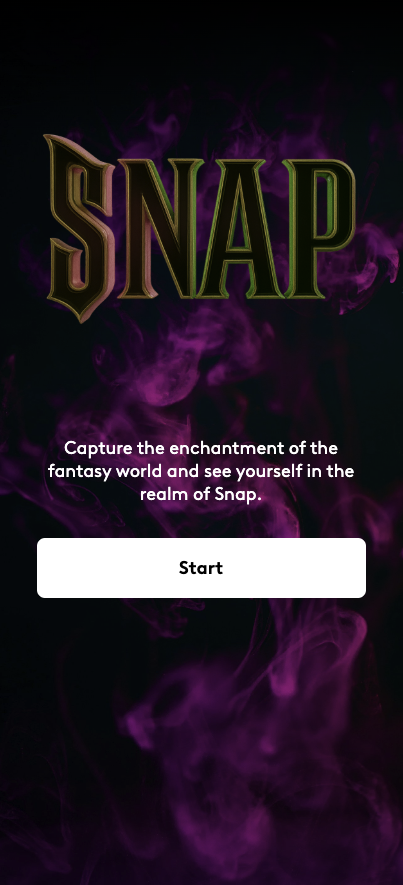

# Selfie Snap App

  

## Overview

A web application that allows users to capture selfies using their device's camera, apply filters, and save or share the images.

### Features

- Capture selfies using the device's webcam.
- Apply real-time filters (e.g., grayscale, sepia, brightness) to the video feed.
- Take snapshots and save them as downloadable images.
- Responsive design for desktop and mobile devices.
- Simple and intuitive user interface.

### Technologies

- React: JavaScript library for building the user interface.
- HTML5: Structure of the web page.
- CSS3: Styling with Tailwind CSS for responsive design.
- JavaScript: Client-side logic for camera access and image processing.
- HTML5 Canvas: Used for capturing and manipulating snapshots.
- WebRTC: Enables webcam access for video streaming.
- Netlify: Hosting the deployed application.
- Vite: Build tool for fast development and production builds.

## Demo

Try the live app at [here](https://selfie-snap-react-app.netlify.app/).

## Getting Started

### Prerequisites

- Node.js and npm installed for local development.
- A modern web browser with WebRTC support (e.g., Chrome, Firefox).

### Installation

#### 1. Clone the repository:

git clone https://github.com/vanessacl/snap-app.git

#### 2. Navigate to the project directory:

cd snap-app

#### Install dependencies:

npm install

#### 3. Run the development server::

npm run dev

#### 4. Serve the application:

Use a local server (e.g., VS Code Live Server) or open index.html in a browser.

#### 5. Open the application:

Open http://localhost:5173 in your browser (or the port specified by Vite).

## Deployment

- Deploy the project to Netlify by connecting your GitHub repository.
- The app will be live at the Netlify-provided URL (e.g., https://selfie-snap-react-app.netlify.app).

## Usage

1. Open the app in a web browser.
2. Allow camera access when prompted.
3. Use the filter options to apply effects to the live video feed.
4. Click the capture button to take a snapshot.
5. Download the snapshot or share it using the provided options.

## Contributing

Feel free to submit issues or pull requests on the GitHub repository.

## Acknowledgments

- React for the component-based architecture.
- Sass for styling.
- Netlify for seamless hosting.
- WebRTC for enabling webcam functionality.

## License

This project is licensed under the MIT License.
