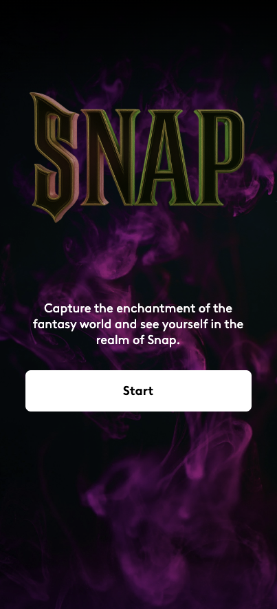

# Selfie Snap App

Capture a photo in the browser, apply live filters, and download the result — no plugins.



**Live demo:** [selfie-snap-react-app.netlify.app](https://selfie-snap-react-app.netlify.app/)

> Best on a phone or with a webcam. Desktop may ask you to allow camera access.

## What it does

- Live webcam feed via WebRTC
- Real-time filters (grayscale, sepia, brightness, and related effects)
- Snapshot with the Canvas API
- Download the processed image

## Stack

React · Vite · Sass · WebRTC · Canvas API · Netlify

## Run locally

```bash
git clone https://github.com/vanessacl/snap-app.git
cd snap-app
npm install
npm run dev
```
Open the URL Vite prints (usually <code>http://localhost:5173</code>) and allow camera access.

## Why this project
Browser media APIs end-to-end: permissions, live video, canvas processing, and a simple React UI around them.

## License

This project is licensed under the MIT License.
